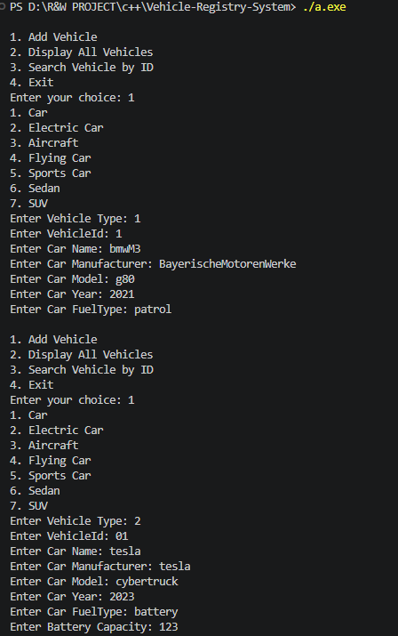
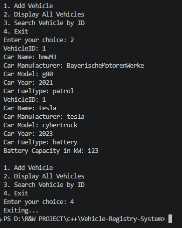

# 🚗 Vehicle Registry System

A simple **Vehicle Registry System in C++** developed as an individual OOP project.

This project demonstrates important Object-Oriented Programming concepts such as **Encapsulation, Inheritance, Classes and Objects, Constructors, Destructors, Static Members, Getters & Setters, and different types of Inheritance**.

---

## 📌 Project Overview

The Vehicle Registry System allows users to manage different types of vehicles and perform basic registry operations.

The system supports:

* Vehicle
* Car
* Electric Car
* Sports Car
* Sedan
* SUV
* Aircraft
* Flying Car
* Add Vehicle
* Display All Vehicles
* Search Vehicle by ID
* Menu-Driven Interface

---

## 🛠️ Technologies Used

* **Language:** C++
* **IDE:** Visual Studio Code
* **Compiler:** GCC / G++
* **Concept:** Object-Oriented Programming

---

## 🧠 OOP Concepts Used

### 1. Encapsulation

Vehicle information is kept inside classes using private data members.

Getters and setters are used to access and modify private data.

---

### 2. Single Inheritance

`Car` inherits from `Vehicle`.

```text
Vehicle
   ↓
  Car
```

---

### 3. Multilevel Inheritance

`ElectricCar` inherits from `Car`, and `SportsCar` inherits from `ElectricCar`.

```text
Vehicle
   ↓
  Car
   ↓
ElectricCar
   ↓
SportsCar
```

---

### 4. Hierarchical Inheritance

Multiple classes inherit from `Car`.

```text
       Car
      /   \
   Sedan   SUV
```

---

### 5. Multiple Inheritance

`FlyingCar` inherits from both `Car` and `Aircraft`.

```text
Car ───────┐
           ↓
       FlyingCar
           ↑
Aircraft ──┘
```

---

### 6. Classes and Objects

The project uses different classes to represent different types of vehicles and creates objects from these classes.

---

### 7. Static Member

A static member `totalVehicles` is used to keep track of vehicle objects.

---

### 8. Constructors and Destructor

Constructors are used to initialize vehicle objects.

A destructor is used when vehicle objects are destroyed.

---

### 9. Getters and Setters

Getter methods are used to retrieve private data, while setter methods are used to modify private data.

---

## 🚘 Vehicle Types

### Vehicle

Base class containing common vehicle information:

* Vehicle ID
* Vehicle Name
* Manufacturer
* Model
* Year

---

### Car

Inherits from `Vehicle`.

Additional information:

* Fuel Type

---

### Electric Car

Inherits from `Car`.

Additional information:

* Battery Capacity

---

### Sports Car

Inherits from `ElectricCar`.

Additional information:

* Top Speed

---

### Sedan

Inherits from `Car`.

---

### SUV

Inherits from `Car`.

---

### Aircraft

Contains aircraft-specific information:

* Flight Range

---

### Flying Car

Uses multiple inheritance from:

* `Car`
* `Aircraft`

---

## 📋 Main Features

### Add Vehicle

The user can add different types of vehicles through the menu.

### Display All Vehicles

Displays all registered vehicle records.

### Search Vehicle

The user can search for a vehicle using its Vehicle ID.

### Menu-Driven Interface

The system provides a simple menu for performing registry operations.

---

## 🖥️ Sample Output

### Output 1



### Output 2



### Output 3


### Output 4


---

## 📂 Project Structure

```text
Vehicle-Registry-System/
│
├── outputs/
│   ├── output-1.png
│   ├── output-2.png
│   ├── output-3.png
│   └── output-4.png
│
├── vehicle-registry.cpp
└── README.md
```

---

## ▶️ How to Run

### 1. Clone the Repository

```bash
git clone https://github.com/Husen77k/Vehicle-Registry-c-.git
```

### 2. Open the Project

Open the project folder in Visual Studio Code.

### 3. Compile the Program

```bash
g++ vehicle-registry.cpp -o vehicle-registry
```

### 4. Run the Program

On Windows:

```bash
vehicle-registry
```

---

## 🎯 Project Objective

The main objective of this project is to understand and implement **Object-Oriented Programming concepts in C++**, especially different types of inheritance and encapsulation, through a simple Vehicle Registry System.

---

